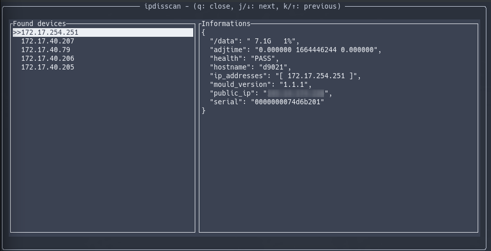

```
██████╗ ██╗██████╗ ██████╗ ██╗███████╗
██╔══██╗██║██╔══██╗██╔══██╗██║██╔════╝
██████╔╝██║██████╔╝██║  ██║██║███████╗
██╔══██╗██║██╔═══╝ ██║  ██║██║╚════██║
██║  ██║██║██║     ██████╔╝██║███████║
╚═╝  ╚═╝╚═╝╚═╝     ╚═════╝ ╚═╝╚══════╝
```

<!--Font: ANSI Shadow-->



Use UDP broadcasting to discover devices and report information about systems
in the Local Area Network.

This project include a server part, `ipdisserver` and a client part,
`ipdisscan`.

`ipdisserver` listen by default on port 1901,
`ipdisscan` broadcast by default from port 1902.

Both tools have CLI options to change the default behaviour.

See [ipdisserver README](ipdisserver/README.md)
and [ipdisscan README](ipdisscan/README.md)
for more information.
