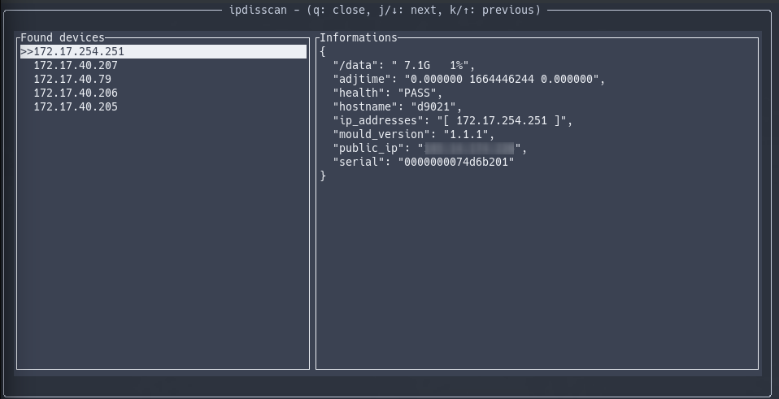

```
██╗██████╗ ██████╗ ██╗███████╗███████╗ ██████╗ █████╗ ███╗   ██╗
██║██╔══██╗██╔══██╗██║██╔════╝██╔════╝██╔════╝██╔══██╗████╗  ██║
██║██████╔╝██║  ██║██║███████╗███████╗██║     ███████║██╔██╗ ██║
██║██╔═══╝ ██║  ██║██║╚════██║╚════██║██║     ██╔══██║██║╚██╗██║
██║██║     ██████╔╝██║███████║███████║╚██████╗██║  ██║██║ ╚████║
╚═╝╚═╝     ╚═════╝ ╚═╝╚══════╝╚══════╝ ╚═════╝╚═╝  ╚═╝╚═╝  ╚═══╝
```

<!--Font: ANSI Shadow-->

ipdisscan: scan the network broadcast domain and collect informations about
systems where an instance of [ipdisserver](../ipdisserver/README.md) is
running.

## About



`ipdisscan` continuously send UDP broadcast datagrams (by default from port
1902), containing a signature recognized by running ipdisserver instances.

Informations contained in ipdisserver answers are collected and reported in a
simil-YAML format, being continuously updated.

## Usage

Run `ipdisscan --help` for the CLI documentation.

Logs go to standard error.

### Environment variables

`RUST_LOG` changes logs verbosity.
E.g.:
`export RUST_LOG=debug`,
`export RUST_LOG=trace`.
[Full documentation](https://docs.rs/tracing-subscriber/latest/tracing_subscriber/filter/struct.EnvFilter.html#directives).
